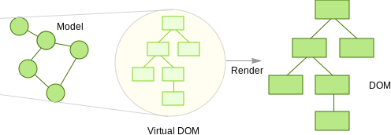

- title : Do you even type, Bro?
- description : Introduction to Elm
- author : Youenn Bouglouan
- theme : night
- transition : default

***

## Do you even type, Bro?

***

### <ct>Who am I?</ct>

Youenn Bouglouan

C# developer by day, F# practicioner by night

 http://www.ybouglouan.pl

 <aside class="notes">
		blog where I talk about various things like creating websites using F#,
    functional programming, REST APIs, how to write good specs...
 </aside>

---

### <ct>Why today's topic?</ct>

<p class="fragment fade-in">Spaces vs Tabs</p>

<p class="fragment fade-in">Waterfall vs Agile</p>

<p class="fragment fade-in">Java vs C#</p>

<p class="fragment fade-in">PC vs Mac (vs Linux)</p>

<p class="fragment fade-in">Object Oriented vs Functional</p>

<ct><p class="fragment fade-in">Weakly Typed vs Strongly Typed</p></ct>

 <aside class="notes">
		as the good programmers that we are, we often like to have strong opinions
    on things we don't necessarily understand. Things like the following...

    Today I want to shed some light on this last point, because I quite often
    read or hear someone say "I prefer Java or C++ or C# because it's strongly typed
    and safer", or the opposite argument like "I use JavaScript because I know what I'm doing
    and don't want to hinder my creativity!". While there's some truth in this, very often we
    don't have enough knowledge about other languages out there and other programming paradigms
    to have a proper discussion on the topic. So discussions like that generally boil down to
    "my language is better than yours because this is the only language I know and your language sucks anyway".
 </aside>

---

### <ct>Who is this presentation for?</ct>

<p class="fragment fade-in">Developers -> get a better idea of what's out there</p>

<p class="fragment fade-in">QA Specialists -> understand why there are bugs and issues</p>

 <aside class="notes">
		For developers, encourage you to try other languages, other paradigms, see how others
    might do certain things better, and how can you transfer this knowledge into your own language...

    For our QA friends, I'd like to uncover some of the reasons why we have so many bugs or issues in our programs,
    and why those bugs seem to appear over and over again. Because it's not only because we developers suck
    (well sometimes it is), but also because we don't always use the best tools available for the job.
 </aside>

***

### <ct>Typing 101</ct>

***

### What's a <ct>Type</ct>?

A way to represent <ct>data</ct> or <ct>behavior</ct> within a programming language

* <ct>primitive types</ct> (int, bool, char, float...)

* <ct>product types</ct> (classes, records, objects, tuples...)

* <ct>sum types</ct> (unions but not only... we'll see those later!)

* <ct>sets</ct> (lists, arrays, maps, dictionaries...)

* <ct>functions</ct>(!)

* <ct>interfaces</ct>(!)

***

### What's a <ct>Type System</ct>?

***

### <ct>Typing:</ct>
### Dynamic vs Static

---

### <ct>Dynamic</ct>

types are checked at <ct>runtime</ct> -> runtime errors

```fsharp
// Python
x = 10
y = x + 1 // Ok
z = x + "1" // Runtime error
// TypeError: unsupported operand type(s) for +: 'int' and 'str'
```

---

### <ct>Static</ct>

Types are checked at <ct>compile time</ct> -> compilation errors

```fsharp
// F#
let x = 10
let y = x + 1 // Ok
let z = x + "1" // Compiler error
// The type 'string' does not match the type 'int'
```

***

### <ct>Typing:</ct>
### Weak vs Strong

Not the same as Dynamic vs Static!

---

### <ct>Weak</ct>

type checking is not (very) strict

implicit conversions (usually)

little guarantees on the program's correctness

---

### <ct>Weak</ct> typing in a <ct>dynamic</ct> language

```fsharp
// JavaScript
'1' + '2' // returns the string "12"
'5' - '2' // returns the number -1
'5' * '2' // returns the number 10
var myObject = { valueOf: function () { return 3 }} // myObject is an Object
'1' + myObject // returns a string: "13"
1 + myObject // returns a string: 4
[] + {} // returns an Object
{} + [] // returns the number 0... wait whaaaaaaaaaaaaaaaaaaaat?
```

---

### <ct>Weak</ct> typing in a <ct>static</ct> language - 1

```fsharp
// C#
var x = 2 + 2.0; // x is a double with value 4
var y = 2.1 + "2"; // y is a string with value "2.12"

char c = 'a';
int i = c; // i is an integer with value 97

int x = 100000;
int y = (short) x; // y is an integer with value -31072 due to integer overflow
```

---

### <ct>Weak</ct> typing in a <ct>static</ct> language - 2

```fsharp
// C#
public class Animal {}
public class Reptile : Animal {}
public class Mammal : Animal {}

public void Test(Animal a)
{
  var r = (Reptile) a;
}

Test(new Mammal());
// Run-time exception: Unable to cast object of type 'Mammal' to type 'Reptile'.
```

---

### <ct>Strong</ct>

Type checking is strict(er)

program's correctness is easier to prove (well, in theory)

conversions must be explicit

---

### <ct>Strong</ct> typing in a <ct>dynamic</ct> language

Back to our first example in Python!

```fsharp
// Python
x = 10
y = x + 1 // Ok
z = x + "1" // Runtime error
// TypeError: unsupported operand type(s) for +: 'int' and 'str'
```

---

### <ct>Strong</ct> typing in a <ct>static</ct> language

```fsharp
// F#
let x = 2 + 2.0 // Compiler error, The type 'float' does not match the type 'int'
let y = 2.1 + "2" // Compiler error, The type 'string' does not match the type 'float'

let c: char = 'a'
let i: int = c // Compiler error, expected to have type 'int' but here has type 'char'

let x: int = 100000
let y: int = int16 x // Compiler error, expected to have type 'int' but here has type 'int16'
let z = int16 x // this compiles and runs, but the result still is -31072
```

***

### <ct>Typing:</ct>
### Nominal vs Structural

applies to static typing

---

### <ct>Nominal</ct>

Very popular in mainstream languages like C#, C++, or Java  

Types are identified by their respective <ct>names</ct>

```fsharp
// C#
class Employee { public string Name; }
class Animal { public string Name; }

string Hire(Employee employee)
{
  // some fancy logic here...
  return employee.Name;
}

var name = Hire(new Employee()); // This works
var name = Hire(new Animal()); // This doesn't as 'Hire' explicitly expects an 'Employee'
```

---

### <ct>Structural</ct>

Also called row polymorphism

Types are identified by their respective <ct>structures</ct> and <ct>properties</ct>

Present under different forms in Elm, Go, TypeScript, Scala, OCaml, Haskell...

```fsharp
// Elm
hire: { name: String } -> String
hire entity =
  // Some fancy logic here...
  entity.name

hire { name = "Tomek Nowak" } // This works, returns the string 'Tomek Nowak'
hire { name = "Garfield" } // This also works, returns the string 'Garfield'
```

---
But there's more...

### Structural <ct>subtyping</ct>

Beware the awesomeness!

```fsharp
// Elm
type alias TypeWithName a = { a | name: String }

hire: TypeWithName a -> String
hire entity =
  // Some fancy logic here...
  entity.name

hire { name = "Tomek Nowak", age = 25, gender = "male" } // This still works!
hire { name = "Garfield", canFly = False, hasPaws = True } // And this works too!
```

The actual structure of the types is checked as compile-time,
making this super safe while giving a dynamic feel to the language

---

### <ct>Structural</ct> typing
#### for <ct>implicit</ct> interface implementation

```fsharp
// Go
type Stringer interface {
  String() string
}

import ("fmt")

type User struct {
  name string
}

func (user User) String() string {
  return fmt.Sprintf("User: name = %s", user.name)
}

func main() {
  user := User{name: "Tomek Nowak"}
  fmt.Println(user) // fmt.Println(...) takes a Stringer interface as parameter
  //prints 'User: name = Tomek Nowak'
}
```

***

### <ct>Duck</ct> Typing

<quote>If it looks like a duck, swims like a duck, and quacks like a duck, then it probably is a duck.</quote>

basically the same as structural typing, but at <ct>runtime</ct>!

```fsharp
// Python
class Duck:
    def quack(self):
        print("Quack!")

class Dog:
    def bark(self):
        print("Woooof!")

def lets_quack(animal):
  animal.quack()

donaldTusk = Duck()
rex = Dog()

lets_quack(donaldTusk) // prints 'Quack!'
lets_quack(rex) // runtime error!
```

---

### <ct>TODO</ct>

example of duck typing in Python

***

### A word about <ct>Type Inference</ct>

!link tweet to Java var introduction!

***

## So, what is the issue here?


---

## Hard to track when and where changes are made

 

---

## Programming languages 


| Functional  | Imperative  |
|:-:|:-:|
| series of expressions   | series of statements  |
| immutable state | mutable state |
| purity (same input -> same output)  | side effects |

--- 

## Yeah... but why ELM ?? 

### What is so unique in it?

* Functional but beginner-friendly 
    - Concepts are easy to understand and learn 
    - Nice introduction to the functional world
* Statically typed
* Immutable data
* Funtional types system - no null
* No runtime exceptions!
* Consistent management of state (famous ELM architecture)
* Interoperability with JavaScript
    * compiles to JS
* ELM time-travel debugger
* ...

### Function Composition

```elm
isEven: Int -> Bool
isEven n = n % 2 == 0

// (<<) (b -> c) -> (a -> b) -> a -> c
// not: Bool -> Bool

isOdd: Int -> Bool
isOdd: not << isEven
```

---

### Function Application

* pipe operator

```elm
(|>) : a -> (a -> b) -> b
// x |> f is the same as f x 

myFunction: List number -> String
myFunction someNumbers = 
  someNumbers
  |> List.filter (\x -> x > 2)
  |> List.length
  |> toString
// myFunction [1,2,3,4,5] returns "3"

// alternatively: 
myFunction = toString << List.length << List.filter (\x -> x > 2)
```

---

### Pattern matching

```elm
listSum : List number -> number
listSum myList =
    case myList of
        [] -> 0
        x :: xs -> x + listSum xs
// listSum [1,2] returns 3

listLength: List a -> number
listLength myList =
    case myList of
        [] -> 0
        _ :: xs -> 1 + listLength xs
// listLength [1,2] returns 2
```
---

### Functions as first class values

```elm
listFilter: (a -> Bool) -> List a -> List a
listFilter fn myList =
    case myList of 
        [] -> []
        x::xs -> 
            if fn x then x::(listFilter fn xs)
            else listFilter fn xs
// listFilter (\x -> x == 2) [1,2,1,2,1,2] returns [2,2,2]
```
---

### Type Aliases

```elm
type alias UserName = String
type alias UserId = Int

type alias User = 
    { name: UserName
    , id: UserId
    }
// types as a helpful design tool!
```

---

### Union Types

```elm
type Msg 
    = Increment
    | Decrement
    | SetValue Int
```

---

### Tuples

```elm
myTuple = ("A", "B", "C")
myNestedTuple = ("A", "B", "C", ("X", "Y", "Z"))

let
  (a,b,c) = myTuple
in 
  a ++ b ++ c
// result is "ABC"

let
  (a,b,c,(x,y,z)) = myNestedTuple
in
  a ++ b ++ c ++ x ++ y ++ z
// result is "ABCXYZ"
```

---

### Tuples - pattern matching

```elm
isOrdered: (String, String, String) -> String
isOrdered tuple =
 case tuple of
  ("A","B","C") as orderedTuple ->
    toString orderedTuple ++ " is an ordered tuple."
    
  (_,_,_) as unorderedTuple ->
    toString unorderedTuple ++ " is an unordered tuple."


> isOrdered myTuple
"(\"A\",\"B\",\"C\") is an ordered tuple."

> isOrdered ("B", "C", "A")
"(\"B\",\"C\",\"A\") is an unordered tuple."
```

---

### Examples ...

```elm
type Visibility = All | Active | Completed

> All
All : Visibility

> Active
Active : Visibility

> Completed
Completed : Visibility
```

---

### ... Examples ...

```elm
type alias Task = { task : String, complete : Bool }

buy : Task
buy =
  { task = "Buy milk", complete = True }

drink : Task
drink =
  { task = "Drink milk", complete = False }

tasks : List Task
tasks =
  [ buy, drink ]
```

---

### ... Examples

```elm
type Visibility = All | Active | Completed
type alias Task = { task : String, complete : Bool }

keep: Visibility -> List Task -> List Task
keep visibility tasks =
  case visibility of
    All -> tasks
    Active -> List.filter (\task -> not task.complete) tasks
    Completed -> List.filter (\task -> task.complete) tasks

// keep All tasks      returns [buy,drink]
// keep Active tasks   returns [drink]
// keep Complete tasks returns [buy]
```

*** 

### Model - View - Update

### "Elm - Architecture"

 


 <small>http://danielbachler.de/2016/02/11/berlinjs-talk-about-elm.html</small>


---

### Model - View - Update


```elm
type alias Model = (...) // record type

type Msg = (...) // union type

update: Msg -> Model -> (Model, Cmd Msg)
update msg model = (...)

view: Model -> Html Msg
view model = (...)
```
---

### Model - View - Update


```elm
type Msg 
    = Increment 
    | Decrement

update msg model =
  case msg of
    Increment ->
      model + 1

    Decrement ->
      model - 1

```
---

### Model - View - Update


```elm
view model =
  div []
    [ button [ onClick Decrement ] [ text "-" ]
    , div [] [ text (toString model) ]
    , button [ onClick Increment ] [ text "+" ]
    ]
```

<br/>
<br/>

---

### Virtual DOM - Initial

<br />
<br />


 

<br />
<br />

 <small>http://teropa.info/blog/2015/03/02/change-and-its-detection-in-javascript-frameworks.html</small>

---

### Virtual DOM - Change

<br />
<br />


 

<br />
<br />

 <small>http://teropa.info/blog/2015/03/02/change-and-its-detection-in-javascript-frameworks.html</small>

---

### Virtual DOM - Reuse

<br />
<br />


 

<br />
<br />

 <small>http://teropa.info/blog/2015/03/02/change-and-its-detection-in-javascript-frameworks.html</small>


---

### Model - View - Update

# [Demo](http://elm-lang.org/examples/buttons)

***

### TakeAways

* Learn all the FP you can!
* Simple modular design
* .Net fans? F# (Fable) + Elm!  
* [elm-lang.org/try](http://elm-lang.org/try)

*** 

### Thank you!
* https://www.youtube.com/watch?v=vgsckgtVdoQ
* https://gist.github.com/yang-wei/4f563fbf81ff843e8b1e
* https://github.com/fable-compiler/fable-elmish
* https://ionide.io
* https://facebook.github.io/react-native/
